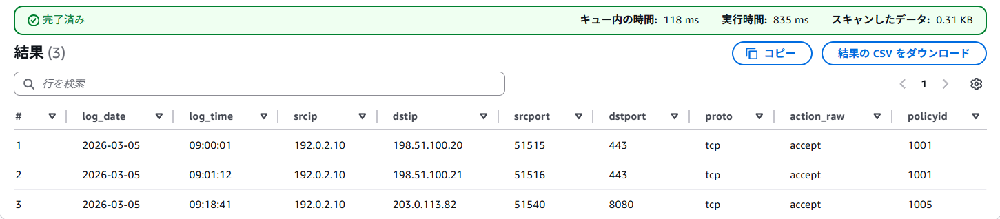
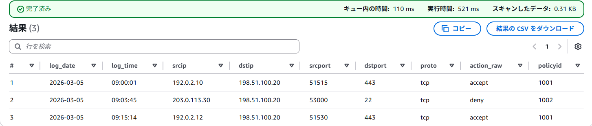
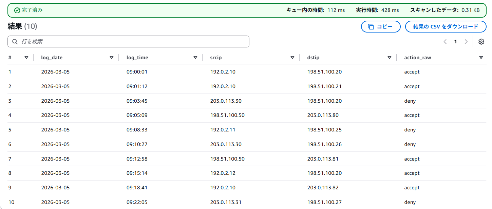
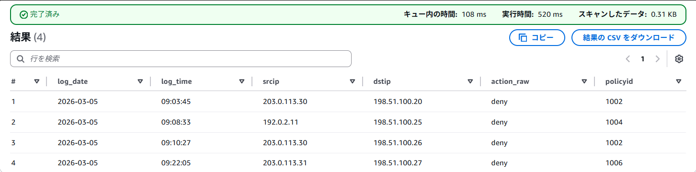
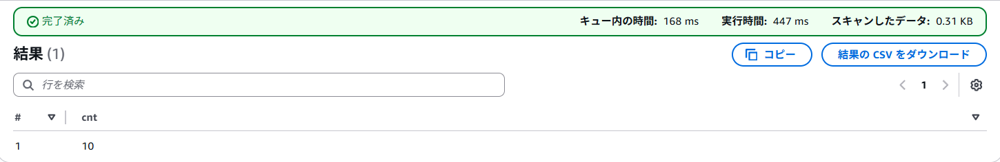

# DoD Checklist

## 1. 目的
- `spec.md` の「13) 受け入れ条件（Definition of Done）」を、証跡付きで確認する。
- 完了判定を曖昧にせず、未達項目があれば明示する。

## 2. 判定ルール
- `確認済み`: 証跡を確認できた
- `未確認`: まだ確認していない
- `未達`: 確認したが要件を満たしていない

## 3. チェックリスト

| No | DoD項目 | 判定 | 証跡 | 備考 |
|---|---|---|---|---|
| 1 | Terraformで `init/plan/apply` が成功し、手作業なしで環境作成できる | 確認済み | `terraform init`: `Terraform has been successfully initialized!` / `terraform plan -var-file="envs/dev.tfvars"`: `No changes. Your infrastructure matches the configuration.` / `terraform apply -var-file="envs/dev.tfvars"`: `Apply complete! Resources: 0 added, 0 changed, 0 destroyed.` | 初回作成後の再実行では差分なし |
| 2 | `fw-log-analytics-<env>-<random>` バケットに Public Access Block、暗号化、Versioning、Lifecycle が適用される | 確認済み | Public Access Block: 全 `true` / Encryption: `AES256` / Versioning: `Enabled` / Lifecycle: ルールあり | S3 は `force_destroy = false` 方針 |
| 3 | Glue DB `fw_log_analytics` とテーブル `fortigate_logs` が作成される | 確認済み | `terraform output`: `glue_database_name = "fw_log_analytics"` / `glue_table_name = "fortigate_logs"` | Table 定義は RegexSerDe 方式 |
| 4 | Athena WorkGroup `fw-log-analytics-wg` が作成され、出力先が強制される | 確認済み | `terraform output`: `athena_workgroup_name = "fw-log-analytics-wg"` / `athena_workgroup_state = "ENABLED"` / `aws athena get-work-group --work-group fw-log-analytics-wg` で `ResultConfiguration.OutputLocation = s3://<bucket>/athena-results/` と `EnforceWorkGroupConfiguration = true` を確認済み | 出力先は `athena-results/` |
| 5 | サンプルログ投入後、テンプレートSQLで `srcip/dstip/期間/action` 検索が実行できる | 確認済み | 下記「4. E2E証跡」を参照 | Issue 21 の実施結果を反映 |
| 6 | README と Runbook に標準検索手順、失敗時の切り分け、再現手順が記載される | 確認済み | `README.md` / `runbook/athena-search.md` / `runbook/sql-templates.md` / `runbook/terraform-validation.md` | destroy 方針は別ファイルで管理 |
| 7 | `terraform destroy` の実行可否方針（誤削除防止設定を含む）が文書化される | 確認済み | `runbook/terraform-destroy-policy.md` | `force_destroy = false` 方針を記載済み |

## 4. E2E証跡

### 4.1 srcip 検索
- 条件: `srcip = '192.0.2.10'`
- 証跡:

### 4.2 dstip 検索
- 条件: `dstip = '198.51.100.20'`
- 証跡:

### 4.3 期間指定検索
- 条件: `09:00:00` から `09:59:59`
- 証跡:

### 4.4 action 検索
- 条件: `action_raw = 'deny'`
- 証跡:

### 4.5 件数確認
- 証跡:

## 5. 証跡の取り方

### 5.1 Terraform
- `terraform init`
- `terraform plan -var-file="envs/dev.tfvars"`
- `terraform apply -var-file="envs/dev.tfvars"`
- `terraform output`

### 5.2 AWS リソース
- S3 バケット設定画面
- Glue Database / Table 画面
- Athena WorkGroup 画面

### 5.3 E2E
- サンプルログアップロード結果
- パーティション反映結果
- `count(*)` 結果
- `srcip` / `dstip` / `期間` / `action_raw` のクエリ結果

## 6. 現時点の完了判定
- **DoD は確認済み**
- 補足:
  - No.1 は再実行時の結果を証跡として記載している
  - 今後環境を再構築した場合は、必要に応じて初回作成時の証跡へ更新する

## 7. 関連資料
- [README.md](../README.md)
- [Athena Search Runbook](athena-search.md)
- [SQL Templates](sql-templates.md)
- [Terraform Validation Runbook](terraform-validation.md)
- [Terraform Destroy Policy](terraform-destroy-policy.md)
